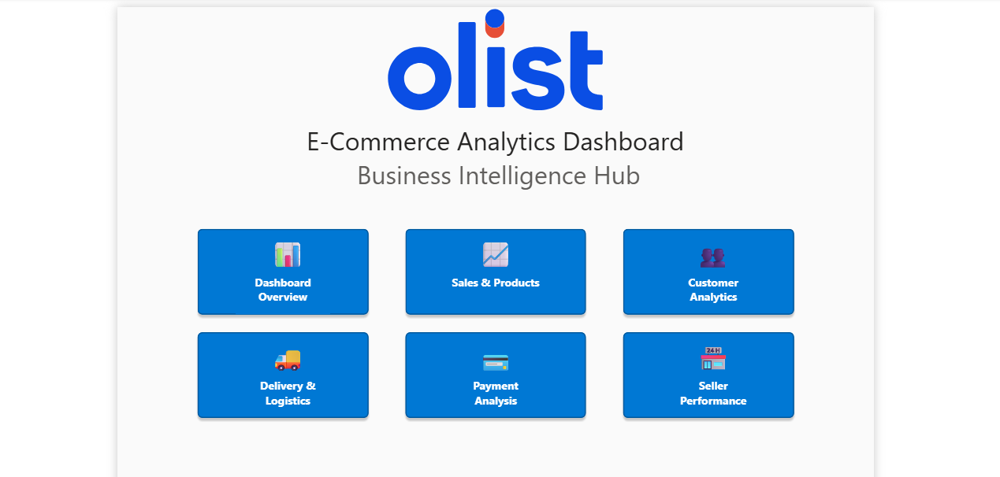
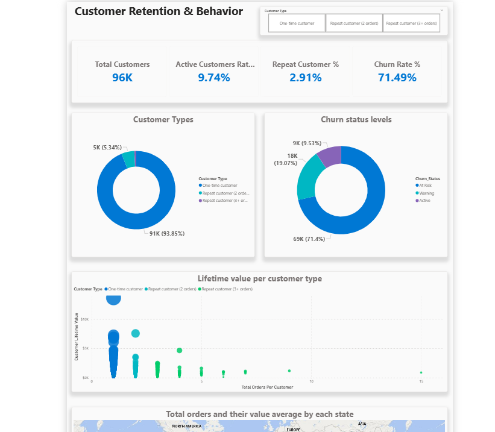
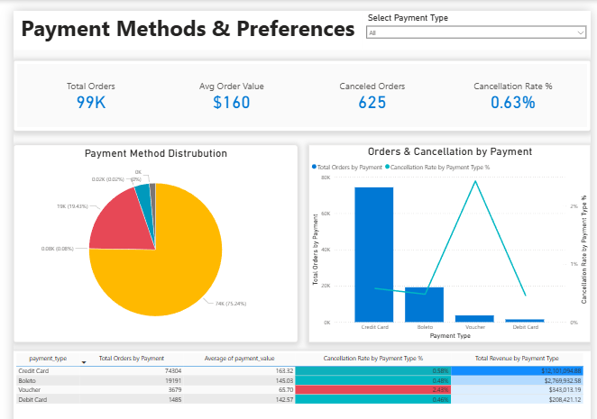
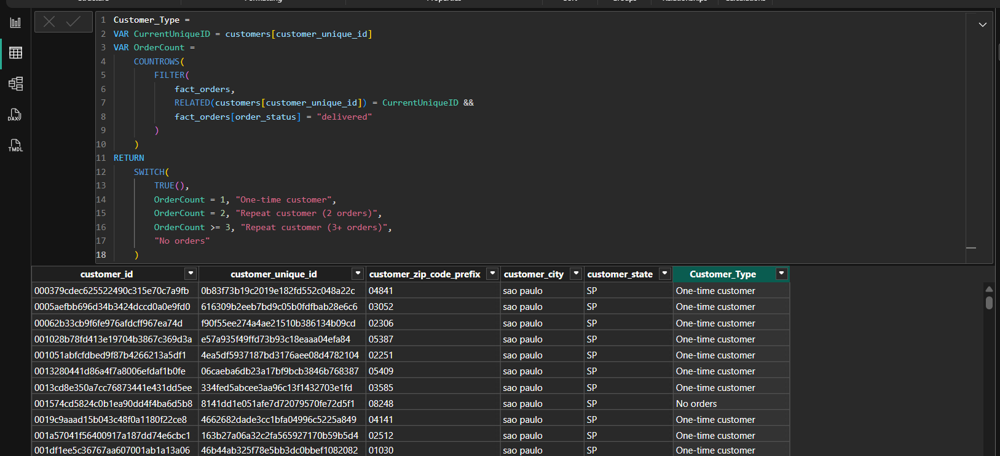
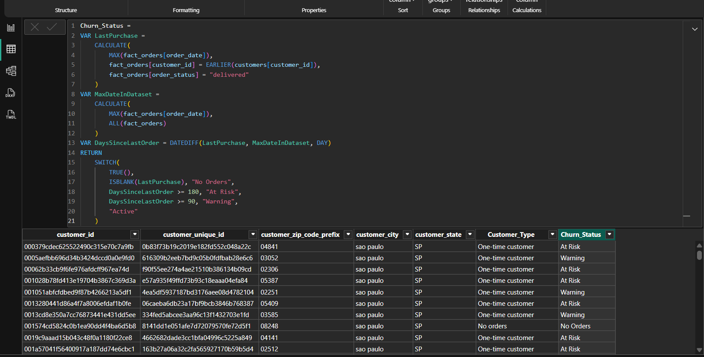

# Olist E-Commerce Analytics Project
## End-to-End Business Intelligence Solution


## Table of Contents
- [Project Overview](#project-overview)
- [Database Architecture](#database-architecture)
- [Dashboard Portfolio](#dashboard-portfolio)
- [Analysis Modules](#analysis-modules)
  - [Sales & Product Analysis](#1-sales--product-analysis)
  - [Customer Retention & Behavior](#2-customer-retention--behavior)
  - [Delivery & Logistics Performance](#3-delivery--logistics-performance)
  - [Payment Methods & Preferences](#4-payment-methods--preferences)
  - [Seller Performance](#5-seller-performance)
- [Key Insights & Findings](#key-insights--findings)
- [Business Recommendations](#business-recommendations)
- [Expected Business Impact](#expected-business-impact)
- [Technical Implementation](#technical-implementation)
- [Skills Demonstrated](#skills-demonstrated)

---
## Project Overview

This project delivers a comprehensive analytical framework for Olist, a Brazilian e-commerce marketplace, combining PostgreSQL for backend data processing with Power BI for interactive visualization. The analysis spans six critical business domains, providing actionable insights to drive strategic decision-making across sales, operations, and customer experience.

**Find Power BI file here**: [E-Commerce_Olist_Viz](E-Commerce_Olist_Viz.pbix)

**Business Context:**
Olist operates as a marketplace platform connecting small and medium businesses with customers across Brazil. Understanding customer behavior, optimizing logistics, and maximizing seller performance are essential to maintaining competitive advantage in the rapidly growing Latin American e-commerce market.

**Primary Objectives:**
- Analyze sales trends and identify revenue drivers across product categories
- Understand customer behavior patterns and quantify churn risks
- Evaluate delivery and logistics operational efficiency
- Assess product portfolio performance and category dynamics
- Examine payment preferences and their impact on conversion
- Measure seller performance and geographic distribution effectiveness

**Dataset:**
- Source: Olist Brazilian E-Commerce Public Dataset (Kaggle)
- Period: September 2016 - October 2018
- Records: 99,441 orders across 100,000+ order items
- Scope: Complete transactional data including orders, payments, reviews, and logistics

---

## Database Architecture

### Schema Design & Implementation

The project implements a normalized relational database following third normal form (3NF) principles, with optimized foreign key constraints and strategic indexing for query performance.

**Core Tables:**
- **customers** - Customer demographic and location information
- **orders** - Order transactions with status tracking and timestamps
- **order_items** - Line-item details including product, price, and freight
- **order_payments** - Payment transaction records with installment data
- **order_reviews** - Customer satisfaction ratings and review text
- **products** - Product catalog with category assignments
- **sellers** - Seller profiles and geographic information
- **geolocation** - Latitude/longitude coordinates for location analysis

**Referential Integrity:**
```sql
-- Example: Foreign Key Constraints
ALTER TABLE orders 
ADD CONSTRAINT fk_orders_customer 
FOREIGN KEY (customer_id) REFERENCES customers(customer_id);

ALTER TABLE order_items 
ADD CONSTRAINT fk_order_items_order 
FOREIGN KEY (order_id) REFERENCES orders(order_id);

ALTER TABLE order_items 
ADD CONSTRAINT fk_order_items_product 
FOREIGN KEY (product_id) REFERENCES products(product_id);
```

**Performance Optimization:**
```sql
-- Strategic Indexing for Query Performance
CREATE INDEX idx_orders_customer_id ON orders(customer_id);
CREATE INDEX idx_orders_status ON orders(order_status);
CREATE INDEX idx_orders_purchase_date ON orders(order_purchase_timestamp);
CREATE INDEX idx_order_items_product_id ON order_items(product_id);
CREATE INDEX idx_order_items_seller_id ON order_items(seller_id);
```
### Data Cleaning & Transformation

Comprehensive data quality measures were implemented to ensure analytical accuracy:

**Data Quality Operations:**
- **Geolocation Deduplication:** Reduced 1,000,163 records to 19,015 unique coordinates
- **State Code Standardization:** Uppercase formatting and whitespace trimming
- **NULL Handling:** Replaced 58,247 NULL review comments with appropriate defaults
- **Calculated Fields:** Added delivery_delay_days, on_time_delivery flags, and performance metrics
- **Date Dimension:** Created time-series dimension table for temporal analysis
```sql
-- Example: Delivery Performance Metrics
ALTER TABLE orders ADD COLUMN delivery_delay_days INTEGER;

UPDATE orders
SET delivery_delay_days = EXTRACT(DAY FROM 
    (order_delivered_customer_date - order_estimated_delivery_date))
WHERE order_delivered_customer_date IS NOT NULL 
  AND order_estimated_delivery_date IS NOT NULL;

ALTER TABLE orders ADD COLUMN on_time_delivery BOOLEAN;

UPDATE orders
SET on_time_delivery = CASE 
    WHEN order_delivered_customer_date <= order_estimated_delivery_date 
    THEN TRUE 
    ELSE FALSE 
END
WHERE order_delivered_customer_date IS NOT NULL;
```

**Power BI Optimization:**
```sql
-- Fact Table for Aggregated Metrics
CREATE TABLE fact_orders AS
SELECT 
    orders.order_id,
    orders.customer_id,
    orders.order_status,
    orders.order_purchase_timestamp::DATE AS order_date,
    orders.order_delivered_customer_date::DATE AS delivery_date,
    orders.order_estimated_delivery_date::DATE AS estimated_delivery_date,
    orders.delivery_delay_days,
    orders.on_time_delivery,
    SUM(order_items.price) AS total_product_value,
    SUM(order_items.freight_value) AS total_freight_value,
    SUM(order_items.price + order_items.freight_value) AS total_order_value,
    COUNT(order_items.order_item_id) AS total_items,
    AVG(order_reviews.review_score) AS avg_review_score
FROM orders
LEFT JOIN order_items ON orders.order_id = order_items.order_id
LEFT JOIN order_reviews ON orders.order_id = order_reviews.order_id
GROUP BY 
    orders.order_id,
    orders.customer_id,
    orders.order_status,
    orders.order_purchase_timestamp,
    orders.order_delivered_customer_date,
    orders.order_estimated_delivery_date,
    orders.delivery_delay_days,
    orders.on_time_delivery;

ALTER TABLE fact_orders ADD PRIMARY KEY (order_id);

-- Date Dimension for Time-Series Analysis
CREATE TABLE dim_date AS
SELECT DISTINCT
    DATE(orders.order_purchase_timestamp) AS date,
    EXTRACT(YEAR FROM orders.order_purchase_timestamp) AS year,
    EXTRACT(MONTH FROM orders.order_purchase_timestamp) AS month,
    EXTRACT(DAY FROM orders.order_purchase_timestamp) AS day,
    EXTRACT(QUARTER FROM orders.order_purchase_timestamp) AS quarter,
    TO_CHAR(orders.order_purchase_timestamp, 'Month') AS month_name,
    TO_CHAR(orders.order_purchase_timestamp, 'Day') AS day_name,
    EXTRACT(DOW FROM orders.order_purchase_timestamp) AS day_of_week,
    EXTRACT(WEEK FROM orders.order_purchase_timestamp) AS week_of_year
FROM orders
WHERE orders.order_purchase_timestamp IS NOT NULL
ORDER BY date;

ALTER TABLE dim_date ADD PRIMARY KEY (date);
```

---
## Dashboard Portfolio

### Executive Overview Dashboard


**Purpose:** Provides C-suite and stakeholders with consolidated high-level KPIs for rapid business assessment.

**Key Components:**
- **Primary KPI Cards** - Total Revenue ($16M), Total Orders (99K), Average Order Value ($160), Delivered Orders (96K)
- **Sales Trends Visualization** - Time-series dual-axis line chart showing revenue and order volume trend
- **Top Categories Revenue** - Horizontal bar chart ranking top 10 product categories
- **Geographic Distribution** - Interactive map displaying revenue concentration by state
- **Performance Metrics Panel** - Repeat Customer Rate (3%), Churn Rate (71.49%), Active Rate (9.74%), On-Time Delivery (93.23%)

**Business Value:** Enables quick identification of performance trends, facilitates drill-down into specific areas of concern, and provides entry point for deeper analytical exploration.

---
## Analysis Modules

## 1. Sales & Product Analysis


**Find SQL code file**: [Here](sql_files/1.Sales_performance_analysis.sql)

### Dashboard Overview

**Purpose:** Comprehensive view of revenue performance and product portfolio optimization to identify top performers and growth opportunities.

**Dashboard Components:**
- **Revenue Metrics** - Real-time KPIs for Total Revenue, Total Orders, and Average Order Value
- **Revenue & MoM Growth Trends** - Dual-axis visualization combining monthly revenue bars with month-over-month growth rate line
- **Top 10 Categories** - Horizontal bar chart ranking categories by revenue contribution
- **Revenue Rank Table** - Detailed breakdown with rank, category, revenue (magnitude bars), and revenue share (proportion bars)
- **Category Filter** - Dropdown selector for category-specific drill-down analysis

**Business Application:** Enables product managers to identify which categories drive revenue, spot emerging trends, optimize inventory allocation, and make data-driven decisions about marketing focus and seller recruitment strategies.

### SQL Analysis Implementation

#### Monthly Sales Trends & Average Order Value
```sql
SELECT
    DATE_TRUNC('month', order_purchase_timestamp) AS month,
    COUNT(DISTINCT orders.order_id) AS total_orders,
    SUM(order_items.price + order_items.freight_value) AS total_revenue,
    ROUND(AVG(order_items.price + order_items.freight_value), 2) AS avg_order_value
FROM orders
JOIN order_items USING (order_id)
WHERE orders.order_status = 'delivered'
GROUP BY month
ORDER BY month;
```

**Query Explanation:**
- Aggregates sales data monthly using DATE_TRUNC function
- Calculates total orders, revenue, and average order value
- Filters for successfully delivered orders only
- Provides time-series data for trend and seasonality analysis

#### Top Revenue-Generating Categories
```sql
SELECT
    products_trans.product_category_name_english,
    COUNT(DISTINCT orders.order_id) AS total_orders,
    SUM(order_items.price + order_items.freight_value) AS total_revenue,
    ROUND(AVG(order_items.price + order_items.freight_value), 2) AS avg_order_value
FROM orders
JOIN order_items USING (order_id)
JOIN products USING (product_id)
JOIN product_category_name_translation AS products_trans 
    ON products.product_category_name = products_trans.product_category_name
WHERE orders.order_status = 'delivered'
GROUP BY products_trans.product_category_name_english
ORDER BY total_revenue DESC;
```

**Query Explanation:**
- Performs multi-table joins to link orders with product categories
- Translates Portuguese category names to English for reporting
- Ranks categories by total revenue contribution
- Calculates category-level average order value for pricing insights

#### Best-Selling Categories with Review Performance
```sql
SELECT
    products_trans.product_category_name_english,
    COUNT(DISTINCT order_items.order_id) AS total_orders,
    SUM(order_items.price) AS total_product_revenue,
    SUM(order_items.price + order_items.freight_value) AS total_revenue_with_freight,
    ROUND(AVG(order_items.price), 2) AS avg_product_price,
    ROUND(AVG(order_reviews.review_score), 2) AS avg_review_score
FROM order_items
JOIN products USING (product_id)
JOIN product_category_name_translation AS products_trans 
    ON products.product_category_name = products_trans.product_category_name
JOIN orders USING (order_id)
LEFT JOIN order_reviews USING (order_id)
WHERE orders.order_status = 'delivered'
GROUP BY products_trans.product_category_name_english
ORDER BY total_revenue_with_freight DESC;
```

**Query Explanation:**
- Aggregates sales metrics by product category
- Separates product revenue from freight charges for margin analysis
- Computes average product price per category
- Includes customer review scores to assess quality perception
- Enables correlation analysis between pricing and satisfaction

#### Month-over-Month Category Growth Analysis
```sql
WITH monthly_category_sales AS (
    SELECT 
        DATE_TRUNC('month', orders.order_purchase_timestamp) AS month,
        products.product_category_name,
        SUM(order_items.price + order_items.freight_value) AS total_revenue,
        COUNT(DISTINCT orders.order_id) AS total_orders
    FROM orders
    JOIN order_items USING (order_id)
    JOIN products USING (product_id)
    WHERE orders.order_status = 'delivered'
        AND products.product_category_name IS NOT NULL
    GROUP BY 
        DATE_TRUNC('month', orders.order_purchase_timestamp),
        products.product_category_name
),
top_5_categories AS (
    SELECT product_category_name
    FROM (
        SELECT 
            product_category_name,
            SUM(total_revenue) AS overall_revenue
        FROM monthly_category_sales
        GROUP BY product_category_name
        ORDER BY overall_revenue DESC
        LIMIT 5
    ) AS top_cats
)
SELECT 
    monthly_category_sales.month,
    monthly_category_sales.product_category_name,
    monthly_category_sales.total_revenue,
    monthly_category_sales.total_orders,
    LAG(monthly_category_sales.total_revenue) OVER (
        PARTITION BY monthly_category_sales.product_category_name 
        ORDER BY monthly_category_sales.month
    ) AS previous_month_revenue,
    ROUND(
        ((monthly_category_sales.total_revenue - LAG(monthly_category_sales.total_revenue) 
            OVER (PARTITION BY monthly_category_sales.product_category_name 
            ORDER BY monthly_category_sales.month)
        ) * 100.0 / 
        NULLIF(LAG(monthly_category_sales.total_revenue) 
            OVER (PARTITION BY monthly_category_sales.product_category_name 
            ORDER BY monthly_category_sales.month), 0)), 
        2
    ) AS mom_growth_rate_pct
FROM monthly_category_sales
INNER JOIN top_5_categories 
    ON monthly_category_sales.product_category_name = 
       top_5_categories.product_category_name
ORDER BY 
    monthly_category_sales.total_revenue DESC,
    monthly_category_sales.month;
```

**Query Explanation:**
- Implements Common Table Expressions (CTEs) for modular query structure
- First CTE aggregates monthly sales by category
- Second CTE identifies top 5 categories by overall revenue
- Main query applies LAG() window function to access previous month data
- Calculates percentage growth month-over-month
- NULLIF prevents division by zero errors
- Identifies trending categories and seasonal patterns

### Key Findings

**Overall Revenue Performance:**
- Total Revenue: $16M over 24-month analysis period
- Total Orders: 99,441 successfully delivered
- Average Order Value: $160
- Delivery Success Rate: 97% (96,478 delivered orders)

**Sales Trend Analysis:**
- Peak performance in November 2017 with revenue exceeding $1.5M
- Clear seasonal patterns with Q4 consistently showing strongest performance
- Steady decline observed from January 2018 onwards, indicating market maturation or competitive pressure
- Month-over-month volatility suggests need for improved demand forecasting and inventory planning
- Revenue and MoM growth chart reveals early period (2016-2017) peak performance with declining trend in recent months

**Top Revenue Categories:**
1. Health & Beauty - $1.45M (9.10% share)
   - Highest revenue generator with consistent performance
   - Indicates strong consumer demand for personal care products
2. Watches & Gifts - $1.31M (8.24% share)
   - Popular gift category with likely seasonal spikes
3. Bed, Bath, Table - $1.28M (7.84% share)
   - Home goods staple with stable, predictable demand
4. Sports & Leisure - $1.17M (7.30% share)
   - Active lifestyle products showing growth opportunity
5. Computers & Accessories - $1.07M (6.69% share)
   - High-value category attracting tech-savvy customers

**Revenue Distribution Insights:**
- Top 10 categories account for approximately 65% of total revenue
- Long tail of smaller categories comprises remaining 35%
- Fairly balanced distribution among top performers (3.69% - 9.10%)
- No single category dominates, indicating healthy portfolio diversification
- Opportunity exists to consolidate or optimize underperforming categories

**Geographic Insights:**
- Primary market concentration in Brazil, specifically Southeast region
- São Paulo region shows highest revenue density on geographic visualization
- Significant untapped opportunity for geographic expansion into underserved regions

**Strategic Observations:**
- High-margin categories (technology, health & beauty) performing well
- Home goods showing stable, recession-resistant demand
- Recent decline warrants investigation into competitive dynamics and market changes
- Opportunity to boost underperforming categories through targeted marketing

### Dashboard Features & Functionality

**Interactive KPI Cards:**
- Real-time metrics with automatic refresh
- Color-coded status indicators for quick assessment
- Clickable for drill-through to detailed reports

**Dual-Axis Sales Trends:**
- Revenue displayed as column chart
- Order volume shown as line chart
- Enables correlation analysis between volume and value metrics
- Identifies whether revenue changes driven by volume or pricing

**Revenue & MoM Growth Analysis:**
- Combined visualization showing absolute revenue and growth rate
- Time-series view highlighting periods of expansion and contraction
- Supports strategic planning and forecasting

**Category Performance Rankings:**
- Sortable horizontal bar chart with data labels
- Precise revenue values for accurate comparison
- Conditional formatting highlights top and bottom performers

**Revenue Rank Table:**
- Multi-column view with sorting capability
- Revenue magnitude visualized with blue data bars
- Market share shown with green proportion bars
- Provides both visual and numerical precision

---

## 2. Customer Retention & Behavior


**Find SQL code file**: [Here](sql_files/2.Customers_base_and_churn.sql)

### Dashboard Overview

**Purpose:** Analyzes customer loyalty patterns, lifetime value distribution, and churn risk segmentation to develop effective retention strategies.

**Dashboard Components:**
- **Customer KPI Cards** - Total Customers (96K), Active Rate (9.74%), Repeat Rate (3%), Churn Rate (71.49%)
- **Customer Type Donut Chart** - Segmentation showing one-time customers (94%) versus repeat customers (6%)
- **Churn Status Donut Chart** - Risk segmentation: Active (9.52%), Warning (18.57%), At Risk (69.27%)
- **CLV Distribution Scatter** - Visualization mapping order frequency against lifetime value, color-coded by customer type
- **Geographic Distribution Map** - Bubble map showing customer concentration across Brazilian states
- **Customer Type Filters** - Toggle controls for segmented analysis

**Business Application:** Enables marketing and CRM teams to identify high-value customers for retention programs, prioritize re-engagement efforts by risk level, develop targeted campaigns, and quantify the financial impact of churn.

### SQL Analysis Implementation

#### Customer Segmentation Analysis
```sql
SELECT
    CASE 
        WHEN order_count = 1 THEN 'One-time customer'
        WHEN order_count = 2 THEN 'Repeat customer (2 orders)'
        WHEN order_count >= 3 THEN 'Repeat customer (3+ orders)'
    END AS customer_type,
    COUNT(customer_unique_id) AS number_of_customers,
    ROUND(COUNT(customer_unique_id) * 100.0 / 
        SUM(COUNT(customer_unique_id)) OVER(), 2) AS percentage
FROM (
    SELECT
        customers.customer_unique_id,
        COUNT(DISTINCT orders.order_id) AS order_count
    FROM customers
    JOIN orders USING (customer_id)
    WHERE orders.order_status = 'delivered'
    GROUP BY customers.customer_unique_id
) customer_orders
GROUP BY customer_type
ORDER BY number_of_customers DESC;
```

**Query Explanation:**
- Subquery counts orders per unique customer
- CASE statement categorizes customers into three segments
- Window function OVER() calculates percentage distribution
- Identifies customer loyalty patterns and repeat purchase behavior

#### Customer Lifetime Value (CLV) Calculation
```sql
-- Customer Lifetime Value (CLV)
SELECT
    customers.customer_unique_id,
    COUNT(DISTINCT orders.order_id) AS total_orders,
    SUM(order_items.price + order_items.freight_value) AS lifetime_value, -- total CLV for customers using customer unique id
    ROUND(AVG(order_items.price + order_items.freight_value), 2) AS avg_order_value, -- calculating average order value for customers
    MIN(orders.order_purchase_timestamp) AS first_purchase_date,
    MAX(orders.order_purchase_timestamp) AS last_purchase_date 
FROM
    customers
JOIN orders USING (customer_id)
JOIN order_items USING (order_id)
WHERE
    orders.order_status = 'delivered'
GROUP BY
    customers.customer_unique_id
ORDER BY
    lifetime_value DESC;
```

**Query Explanation:**
- Aggregates all purchase activity per unique customer
- Calculates Customer lifetime value (CLV)
- Tracks customer acquisition and last interaction dates
- Identifies high-value customers for VIP treatment and retention investment
- Enables cohort analysis and customer lifetime forecasting

#### Churn Risk Classification
```sql
--Churn rate:
WITH dataset_max_date AS (
    SELECT MAX(order_purchase_timestamp)::DATE AS max_date
    FROM orders
)
SELECT
    customers.customer_unique_id,
    customers.customer_state,
    customers.customer_city,
    COUNT(DISTINCT orders.order_id) AS total_orders,
    MAX(orders.order_purchase_timestamp) AS last_purchase_date,
    (SELECT max_date FROM dataset_max_date) - MAX(orders.order_purchase_timestamp)::DATE AS days_since_last_order,
    SUM(order_items.price + order_items.freight_value) AS lifetime_value,
    CASE -- Using a CASE statement to classify customers into baskets.
        WHEN MAX(orders.order_purchase_timestamp) < (SELECT max_date FROM dataset_max_date) - INTERVAL '6 months' THEN 'At Risk'
        WHEN MAX(orders.order_purchase_timestamp) < (SELECT max_date FROM dataset_max_date) - INTERVAL '3 months' THEN 'Warning'
        ELSE 'Active'
    END AS churn_status
FROM
    customers
JOIN orders USING (customer_id)
JOIN order_items USING (order_id)
WHERE
    orders.order_status = 'delivered'
GROUP BY
    customers.customer_unique_id,
    customers.customer_state,
    customers.customer_city
ORDER BY
    days_since_last_order DESC;
```
**Query Explanation:**
- CTE establishes dataset reference date for consistent calculations
- Calculates how recent was last purchase
- Segments customers by churn risk level using business rule thresholds
- Combines recency with lifetime value for prioritized retention targeting
- Enables proactive intervention before customers fully churn

### Key Findings

**Customer Composition:**
- Total Unique Customers: 96,096
- One-time Customer Rate: 94% (approximately 91,000 customers)
- Repeat Customer Rate: 3% (approximately 3,000 customers)
- Active Customer Rate: 9.74%

**Critical Churn Metrics:**
- Overall Churn Rate: 71.49% - indicates severe retention challenge
- At-Risk Customers: 69.27% (inactive for 6+ months)
- Warning Status: 18.57% (inactive for 3-6 months)
- Active Customers: Only 9.52% of total customer base

**Customer Lifetime Value Distribution:**
- Majority of customers cluster in $0-$50,000 CLV range
- Scatter plot visualization reveals high concentration of one-time, low-value customers
- Few high-value repeat customers visible as outliers
- Clear opportunity to shift distribution through retention initiatives

**Geographic Concentration:**
- Heavy customer concentration in Southeast Brazil
- São Paulo region dominates customer base
- Limited market penetration in other regions
- Geographic expansion opportunity exists

**Business Implications:**
The extremely high churn rate (71.49%) and low repeat purchase rate (3%) represent the most critical business challenge identified in this analysis. Customer acquisition costs are being wasted due to poor retention, and the business is operating in a constant state of customer replacement rather than growth.

### Dashboard Features & Functionality

**Segmentation Cards:**
- Real-time customer counts and percentages
- Filter toggles for comparative analysis between segments

**Customer Type Donut:**
- Visual proportion representation
- Interactive selection for filtering other visuals

**Churn Status Donut:**
- Color-coded risk levels (blue=active, yellow=warning, red=at risk)
- Provides immediate visual assessment of customer health

**CLV Distribution Scatter:**
- X-axis: Total orders per customer
- Y-axis: Customer lifetime value
- Color segmentation by customer type
- Identifies clusters and outliers for targeted strategies

---

## 3. Delivery & Logistics Performance


**Find SQL code file**: [Here](sql_files/3.Delivery_effect_and_logistics.sql)

### Dashboard Overview

**Purpose:** Detailed analysis of fulfillment operations, delivery timing accuracy, and the quantifiable impact of logistics performance on customer satisfaction.

**Dashboard Components:**
- **Delivery KPI Cards** - Avg Actual Delivery Days (-10.96), Avg Estimated Days (24.37), Avg Difference (-11.88), On-Time Rate (93.23%)
- **Average Delay by State** - Horizontal bar chart ranking states by delivery performance
- **Delivery Performance vs Reviews** - Clustered bar chart correlating timeliness with review sentiment
- **State Performance Heatmap** - Color-coded table showing delay days, on-time percentage, review scores, and order volume by state
- **State Filter** - Dropdown for geographic drill-down analysis

**Business Application:** Enables operations teams to optimize delivery routes, identify underperforming logistics regions, quantify the relationship between delivery speed and customer satisfaction, and prioritize infrastructure investments.

### SQL Analysis Implementation

#### Overall Delivery Performance Metrics
```sql
--Average delivery vs estimated delivery and actual delivery difference
SELECT
    ROUND(AVG(order_delivered_customer_date::DATE - order_purchase_timestamp::DATE), 2) AS avg_actual_delivery_days,
    ROUND(AVG(order_estimated_delivery_date::DATE - order_purchase_timestamp::DATE), 2) AS avg_estimated_delivery_days,
    ROUND(AVG(order_delivered_customer_date::DATE - order_estimated_delivery_date::DATE), 2) AS avg_delivery_difference,
    COUNT(*) AS total_delivered_orders,
    SUM(CASE WHEN order_delivered_customer_date > order_estimated_delivery_date THEN 1 ELSE 0 END) AS delayed_orders,
    ROUND(SUM(CASE WHEN order_delivered_customer_date > order_estimated_delivery_date THEN 1 ELSE 0 END) * 100 / COUNT(*), 2) AS delayed_percentage
FROM
    orders
WHERE
    order_status = 'delivered'
    AND order_delivered_customer_date IS NOT NULL;
```
**Query Explanation:**
- Performs date arithmetic to calculate actual versus estimated delivery time
- Measures delivery variance (positive indicates delay, negative indicates early delivery)
- Aggregates on-time versus delayed delivery counts
- Calculates on-time percentage for SLA compliance tracking
- Provides comprehensive KPIs for logistics efficiency assessment

#### Geographic Delivery Analysis
```sql
-- Delay in different states
SELECT
    customers.customer_state,
    COUNT(DISTINCT orders.order_id) AS total_orders,
    ROUND(AVG(orders.order_delivered_customer_date::DATE - orders.order_purchase_timestamp::DATE), 2) AS avg_actual_delivery_days,
    ROUND(AVG(orders.order_estimated_delivery_date::DATE - orders.order_purchase_timestamp::DATE), 2) AS avg_estimated_delivery_days,
    ROUND(AVG(orders.order_delivered_customer_date::DATE - orders.order_estimated_delivery_date::DATE), 2) AS avg_delay_days,
    SUM(CASE WHEN orders.order_delivered_customer_date > orders.order_estimated_delivery_date THEN 1 ELSE 0 END) AS delayed_orders,
    ROUND(SUM(CASE WHEN orders.order_delivered_customer_date > orders.order_estimated_delivery_date THEN 1 ELSE 0 END) * 100 / COUNT(*), 2) AS delayed_percentage
FROM
    orders
JOIN customers USING (customer_id)
WHERE
    orders.order_status = 'delivered'
    AND orders.order_delivered_customer_date IS NOT NULL
GROUP BY
    customers.customer_state
ORDER BY
    avg_delay_days DESC;
```
**Query Explanation:**
- Groups delivery metrics by customer state for geographic comparison
- Identifies regions with systematic delivery challenges
- Ranks states from best to worst performance
- Enables targeted logistics infrastructure improvements
- Highlights potential need for regional fulfillment centers

#### Delivery Impact on Customer Satisfaction
```sql
-- Delivery effect on review score
SELECT
    CASE -- Categorizing delivery performance based on actual vs estimated delivery dates
        WHEN orders.order_delivered_customer_date IS NULL 
             OR orders.order_estimated_delivery_date IS NULL THEN 'No Delivery Date'
        WHEN orders.order_delivered_customer_date <= orders.order_estimated_delivery_date THEN 'On Time'
        WHEN (orders.order_delivered_customer_date::DATE - orders.order_estimated_delivery_date::DATE) BETWEEN 1 AND 3 THEN 'Delayed 1-3 days'
        WHEN (orders.order_delivered_customer_date::DATE - orders.order_estimated_delivery_date::DATE) BETWEEN 4 AND 7 THEN 'Delayed 4-7 days'
        WHEN (orders.order_delivered_customer_date::DATE - orders.order_estimated_delivery_date::DATE) > 7 THEN 'Delayed 7+ days'
        ELSE 'Other' -- Catching all for any unexpected cases
    END AS delivery_performance,
    COUNT(DISTINCT orders.order_id) AS total_orders,
    ROUND(AVG(order_reviews.review_score), 2) AS avg_review_score,
    SUM(CASE WHEN order_reviews.review_score >= 4 THEN 1 ELSE 0 END) AS positive_reviews,
    SUM(CASE WHEN order_reviews.review_score <= 2 THEN 1 ELSE 0 END) AS negative_reviews,
    ROUND(SUM(CASE WHEN order_reviews.review_score >= 4 THEN 1 ELSE 0 END) * 100 / COUNT(*), 2) AS positive_review_percentage
FROM
    orders
LEFT JOIN order_reviews USING (order_id)
WHERE
    orders.order_status = 'delivered'
    AND order_reviews.review_score IS NOT NULL
GROUP BY
    delivery_performance
ORDER BY
    delivery_performance;
```
**Query Explanation:**
- Categorizes orders into delivery performance buckets
- Correlates delivery timeliness with customer review scores
- Quantifies impact of delays on customer satisfaction
- Provides empirical data for SLA optimization and expectation management
- Enables ROI calculation for logistics improvement investments

### Key Findings

**Delivery Performance Overview:**
- Average Actual Delivery: -10.96 days (consistently early)
- Average Estimated Delivery: 24.37 days
- Average Delivery Difference: -11.88 days ahead of estimate
- On-Time Delivery Rate: 93.23% (exceeds industry standard)

**State-Level Performance Variance:**
- Best Performers: PR (20.4 days), RO (20.5 days), MG (21.0 days)
- Worst Performers: RR (29.3 days), AP (27.2 days), AM (26.4 days)
- Remote northern states show significantly longer delivery times
- Clear correlation between geographic remoteness and delivery performance
- Heatmap visualization reveals infrastructure gaps

**Delivery-Satisfaction Correlation:**
- On-Time Deliveries: Highest positive review rate (approximately 1,000+ positive reviews)
- Delayed 1-3 Days: Moderate satisfaction decrease
- Delayed 4-7 Days: More pronounced satisfaction drop
- Delayed 7+ Days: Significant negative review increase
- Strong empirical evidence that delivery performance directly drives customer satisfaction

**Strategic Insights:**
- Conservative delivery estimates result in consistently early deliveries
- Current approach sacrifices accuracy for customer satisfaction through exceeded expectations
- Opportunity to adjust estimates to be more precise while maintaining trust
- Remote region infrastructure investment would expand addressable market
- Delivery performance represents a key competitive differentiator

### Dashboard Features & Functionality

**Top KPI Cards:**
- Comparative metrics showing actual versus estimated performance
- Trend indicators showing improvement or deterioration over time
- Color-coded status (green for on-time, red for delays)

**State Performance Bar Chart:**
- Horizontal bars enabling easy comparison across all states
- Data labels showing exact delay days for precision
- Sorted to highlight both best and worst performers

**Delivery-Review Correlation:**
- Clustered bar chart comparing positive and negative review distributions
- X-axis categories showing delay severity levels
- Visual proof of delivery impact justifying logistics investment

**State Performance Heatmap:**
- Integrated view of multiple metrics per state
- Color gradient (red to green) for instant performance assessment
- Sortable columns for flexible analysis prioritization

---
## 4. Payment Methods & Preferences


**Find SQL code file**: [Here](sql_files/5.Payment_analysis.sql)

### Dashboard Overview

**Purpose:** Analyzes customer payment behaviors, preferences, and their correlation with order completion rates to optimize checkout experience and reduce friction.

**Dashboard Components:**
- **Payment KPI Cards** - Total Orders (99K), Avg Order Value ($160), Canceled Orders (625), Cancellation Rate (0.63%)
- **Payment Method Distribution** - Donut chart showing credit card (74%), boleto (19.5%), voucher (5.8%), debit (1.5%)
- **Orders & Cancellation Analysis** - Dual visualization with order volume bars and cancellation rate line
- **Payment Performance Table** - Multi-column breakdown with order count, average value, cancellation rate, and total revenue
- **Payment Type Filter** - Dropdown for method-specific analysis

**Business Application:** Enables finance and product teams to understand payment preferences, identify friction points in checkout flow, optimize payment gateway partnerships, and make data-driven decisions about which payment methods to prioritize or add.

### SQL Analysis Implementation

#### Payment Method Popularity and Performance
```sql
-- Payment types
SELECT
    order_payments.payment_type,
    COUNT(DISTINCT order_payments.order_id) AS total_orders,
    COUNT(order_payments.payment_sequential) AS total_payments,
    SUM(order_payments.payment_value) AS total_payment_value,
    ROUND(AVG(order_payments.payment_value), 2) AS avg_payment_value,
    ROUND(AVG(order_payments.payment_installments), 2) AS avg_installments,
    ROUND(COUNT(DISTINCT order_payments.order_id) * 100.0 / SUM(COUNT(DISTINCT order_payments.order_id)) OVER(), 2) AS percentage_of_orders,
    ROUND(CAST(PERCENT_RANK() OVER (ORDER BY COUNT(DISTINCT order_payments.order_id)) AS NUMERIC), 4) AS percent_rank_by_orders,
    ROUND(CAST(PERCENT_RANK() OVER (ORDER BY SUM(order_payments.payment_value)) AS NUMERIC), 4) AS percent_rank_by_revenue,
    ROUND(CAST(PERCENT_RANK() OVER (ORDER BY AVG(order_payments.payment_value)) AS NUMERIC), 4) AS percent_rank_by_avg_value
FROM
    order_payments
JOIN orders USING (order_id)
WHERE
    orders.order_status = 'delivered'
GROUP BY
    order_payments.payment_type
ORDER BY
    total_orders DESC;
```
**Query Explanation:**
- Aggregates payment data by payment method type
- Distinguishes between order count and total payment transactions (multiple payments per order)
- Calculates average payment value and installment plan usage
- Window function OVER() computes percentage distribution across all payment types
- PERCENT_RANK() ranks payment methods by both popularity and revenue contribution
- Enables identification of preferred payment methods and their revenue impact

#### Installment Plan Behavior Analysis
```sql
-- payment method vs order value
SELECT
    CASE 
        WHEN order_payments.payment_installments = 1 THEN '1 installment (full payment)'
        WHEN order_payments.payment_installments BETWEEN 2 AND 3 THEN '2-3 installments'
        WHEN order_payments.payment_installments BETWEEN 4 AND 6 THEN '4-6 installments'
        WHEN order_payments.payment_installments BETWEEN 7 AND 12 THEN '7-12 installments'
        WHEN order_payments.payment_installments > 12 THEN '12+ installments'
    END AS installment_range,
    COUNT(DISTINCT order_payments.order_id) AS total_orders,
    ROUND(AVG(order_payments.payment_value), 2) AS avg_order_value,
    ROUND(MIN(order_payments.payment_value), 2) AS min_order_value,
    ROUND(MAX(order_payments.payment_value), 2) AS max_order_value,
    ROUND(AVG(order_payments.payment_installments), 2) AS avg_installments_in_range,
    SUM(order_payments.payment_value) AS total_revenue
FROM
    order_payments
JOIN orders USING (order_id)
WHERE
    orders.order_status = 'delivered'
GROUP BY
    installment_range
ORDER BY
    installment_range;
```
**Query Explanation:**
- Categorizes orders by installment plan length
- Analyzes relationship between installment usage and order value
- Calculates min/max/avg order values per installment bucket
- Tests hypothesis: higher-value orders correlate with longer installment plans
- Provides data for optimizing installment offering strategy

#### Payment Method vs Cancellation Correlation
```sql
-- payment method vs order cancellation
WITH order_payment_summary AS (
    SELECT
        orders.order_id,
        orders.order_status,
        order_payments.payment_type,
        SUM(order_payments.payment_value) AS total_payment_value,
        AVG(order_payments.payment_installments) AS avg_installments
    FROM
        orders
    JOIN order_payments USING (order_id)
    GROUP BY
        orders.order_id,
        orders.order_status,
        order_payments.payment_type
)
SELECT
    payment_type,
    COUNT(order_id) AS total_orders,
    SUM(CASE WHEN order_status = 'delivered' THEN 1 ELSE 0 END) AS delivered_orders,
    SUM(CASE WHEN order_status = 'canceled' THEN 1 ELSE 0 END) AS canceled_orders,
    SUM(CASE WHEN order_status = 'unavailable' THEN 1 ELSE 0 END) AS unavailable_orders,
    SUM(CASE WHEN order_status NOT IN ('delivered', 'canceled', 'unavailable') THEN 1 ELSE 0 END) AS other_status_orders,
    ROUND(SUM(CASE WHEN order_status = 'canceled' THEN 1 ELSE 0 END) * 100.0 / COUNT(order_id), 2) AS cancellation_rate,
    ROUND(AVG(total_payment_value), 2) AS avg_payment_value,
    ROUND(AVG(avg_installments), 2) AS avg_installments
FROM
    order_payment_summary
GROUP BY
    payment_type
ORDER BY
    cancellation_rate DESC;
```

**Query Explanation:**
- CTE summarizes payment details aggregated to order level
- Counts orders by final status (delivered, canceled, unavailable)
- Calculates cancellation rate segmented by payment method
- Identifies whether certain payment methods have higher failure rates
- Enables targeted improvement of payment flows with highest friction

### Key Findings

**Payment Method Distribution:**
- Credit Card Dominance: 74% (73,854 orders)
  - Clear customer preference and trust signal
  - Primary payment method by significant margin
- Boleto: 19.5% (19,784 orders)
  - Brazilian-specific payment method (bank slip)
  - Important for customers without credit cards
- Voucher: 5.8% (5,879 orders)
  - Gift cards and promotional codes
  - Lower usage but important for customer acquisition campaigns
- Debit Card: 1.5% (1,485 orders)
  - Surprisingly low adoption despite availability

**Order Value by Payment Method:**
- Relatively consistent average order value across payment types (approximately $160)
- Credit Card: $165 AOV (slightly higher, possibly due to installment availability)
- Boleto: $142 AOV (slightly lower, immediate payment requirement)
- Voucher: $65.37 AOV (promotional and gift orders, lower value)
- Debit: $140.27 AOV (similar to boleto, immediate payment)

**Cancellation Analysis:**
- Overall Cancellation Rate: 0.63% (exceptionally low, indicates smooth checkout experience)
- Credit Card: 74,844 orders, minimal cancellation
- Payment method shows negligible impact on cancellation risk
- Cancellation drivers likely related to inventory or fulfillment rather than payment issues

**Installment Plan Insights:**
- Average installment count: 3-4 months across payment types
- Credit cards enable installment plans, increasing purchasing power
- Boleto typically single payment (cash-equivalent nature)
- Installment availability enables higher-value purchases
- No significant difference in cancellation rates between installment lengths

**Revenue Distribution:**
- Credit Card: $12.4M (77% of total revenue)
- Boleto: $2.9M (18% of total revenue)
- Voucher: $384K (2.4% of total revenue)
- Debit Card: $208K (1.3% of total revenue)

**Strategic Implications:**
- Payment infrastructure is functioning well (low cancellation rate)
- Credit card preference suggests digital-savvy customer base
- Boleto remains important for financial inclusion
- Opportunity to increase debit card adoption through incentives
- Installment plans are key enabler of higher-value purchases

### Dashboard Features & Functionality

**Payment Distribution Donut:**
- Visual proportion breakdown of payment preferences
- Percentage labels for precise understanding
- Color-coded for method identification
- Interactive filtering of other dashboard elements

**Orders & Cancellation Dual-Axis:**
- Clustered bars showing total order volume by payment type
- Line graph overlay showing cancellation rate
- Enables quick identification of problematic payment methods
- Dual-axis scaling for clear visualization of different magnitude metrics

**Payment Performance Table:**
- Comprehensive multi-metric view
- Columns: Payment Type, Total Orders, Avg Payment Value, Cancellation Rate %, Total Revenue
- Color bars indicating relative performance across metrics
- Sortable for flexible analysis and comparison

---
## 5. Seller Performance


**Find SQL code file**: [Here](sql_files/6.Seller_performance_analysis.sql)

### Dashboard Overview

**Purpose:** Comprehensive analysis of the seller ecosystem including geographic distribution, revenue performance, quality metrics, and delivery capabilities to optimize marketplace health.

**Dashboard Components:**
- **Seller KPI Cards** - Total Sellers (3K), States with Presence (23), Avg Revenue per Seller ($5.19K), Avg Review Score (4.16/5.0)
- **Geographic Distribution Map** - Interactive bubble map showing seller concentration, with São Paulo region showing highest density
- **Top Cities by Revenue** - Horizontal bar chart ranking seller markets by total revenue generated
- **Seller State Performance Table** - Breakdown with columns for state, total revenue, total orders, avg review score, and seller count
- **Seller State Filter** - Dropdown for geographic drill-down analysis

**Business Application:** Enables marketplace managers to identify top-performing seller regions, recruit strategically in high-potential markets, maintain platform quality standards, and make data-driven decisions about regional growth initiatives and seller support programs.

### SQL Analysis Implementation

#### Top Seller Performance Analysis
```sql
-- Top sellers
SELECT
    order_items.seller_id,
    COUNT(DISTINCT order_items.order_id) AS total_orders,
    COUNT(DISTINCT order_items.product_id) AS unique_products_sold,
    SUM(order_items.price + order_items.freight_value) AS total_revenue,
    ROUND(AVG(order_items.price + order_items.freight_value), 2) AS avg_order_value,
    ROUND(AVG(order_reviews.review_score), 2) AS avg_review_score,
    COUNT(order_reviews.review_id) AS total_reviews,
    SUM(CASE WHEN order_reviews.review_score >= 4 THEN 1 ELSE 0 END) AS positive_reviews,
    SUM(CASE WHEN order_reviews.review_score <= 2 THEN 1 ELSE 0 END) AS negative_reviews
FROM
    order_items
JOIN orders USING (order_id)
LEFT JOIN order_reviews USING (order_id)
WHERE
    orders.order_status = 'delivered'
GROUP BY
    order_items.seller_id
HAVING
    COUNT(DISTINCT order_items.order_id) >= 10  -- Filter for sellers with at least 10 orders
ORDER BY
    total_revenue DESC
LIMIT 20;
```

**Query Explanation:**
- Aggregates comprehensive performance metrics at seller level
- Counts total orders and unique products sold (diversity metric)
- Calculates revenue and average order value
- Computes review score statistics for quality assessment
- HAVING clause filters for established sellers (minimum 10 orders)
- LEFT JOIN preserves sellers without reviews
- NULLIF prevents division by zero in percentage calculations
- Returns top 20 sellers by revenue for focused analysis

#### Seller Rating Correlation with Sales
```sql
-- Seller ratings
WITH seller_performance AS (
    SELECT
        order_items.seller_id,
        SUM(order_items.price + order_items.freight_value) AS total_revenue,
        COUNT(DISTINCT order_items.order_id) AS total_orders,
        ROUND(AVG(order_reviews.review_score), 2) AS avg_review_score,
        COUNT(order_reviews.review_id) AS total_reviews
    FROM
        order_items
    JOIN orders USING (order_id)
    LEFT JOIN order_reviews USING (order_id)
    WHERE
        orders.order_status = 'delivered'
    GROUP BY
        order_items.seller_id
    HAVING
        COUNT(order_reviews.review_id) >= 5  -- At least 5 reviews for reliable scoring
)
SELECT
    CASE
        WHEN avg_review_score >= 4.5 THEN 'Excellent (4.5-5.0)'
        WHEN avg_review_score >= 4.0 THEN 'Good (4.0-4.49)'
        WHEN avg_review_score >= 3.0 THEN 'Average (3.0-3.99)'
        WHEN avg_review_score >= 2.0 THEN 'Below Average (2.0-2.99)'
        ELSE 'Poor (< 2.0)'
    END AS review_category,
    COUNT(seller_id) AS number_of_sellers,
    ROUND(AVG(total_revenue), 2) AS avg_revenue_per_seller,
    ROUND(AVG(total_orders), 2) AS avg_orders_per_seller,
    SUM(total_revenue) AS total_category_revenue,
    SUM(total_orders) AS total_category_orders,
    ROUND(AVG(avg_review_score), 2) AS avg_review_score_in_category,
    ROUND(CAST(PERCENT_RANK() OVER (ORDER BY AVG(total_revenue)) AS NUMERIC), 4) AS revenue_performance_rank
FROM
    seller_performance
GROUP BY
    review_category
ORDER BY
    avg_review_score_in_category DESC;
```

**Query Explanation:**
- CTE aggregates seller-level performance metrics
- HAVING clause ensures minimum 5 reviews for statistical reliability
- CASE statement categorizes sellers into review tiers
- Analyzes correlation between seller ratings and business performance
- Calculates average revenue and order volume per rating category
- Tests hypothesis: higher-rated sellers generate more sales
- Provides data for quality control and seller incentive program design

#### Seller Location and Delivery Performance
```sql
-- Seller location and delivery times
WITH seller_delivery_performance AS (
    SELECT
        sellers.seller_id,
        sellers.seller_city,
        sellers.seller_state,
        COUNT(DISTINCT orders.order_id) AS total_orders,
        ROUND(AVG(EXTRACT(EPOCH FROM (orders.order_delivered_customer_date - orders.order_purchase_timestamp)) / 86400), 2) AS avg_delivery_days,
        ROUND(AVG(EXTRACT(EPOCH FROM (orders.order_estimated_delivery_date - orders.order_purchase_timestamp)) / 86400), 2) AS avg_estimated_delivery_days,
        SUM(CASE WHEN orders.order_delivered_customer_date <= orders.order_estimated_delivery_date THEN 1 ELSE 0 END) AS on_time_deliveries,
        SUM(CASE WHEN orders.order_delivered_customer_date > orders.order_estimated_delivery_date THEN 1 ELSE 0 END) AS delayed_deliveries,
        ROUND(SUM(CASE WHEN orders.order_delivered_customer_date <= orders.order_estimated_delivery_date THEN 1 ELSE 0 END) * 100.0 / COUNT(DISTINCT orders.order_id), 2) AS on_time_percentage
    FROM
        sellers
    JOIN order_items USING (seller_id)
    JOIN orders USING (order_id)
    WHERE
        orders.order_status = 'delivered'
        AND orders.order_delivered_customer_date IS NOT NULL
        AND orders.order_estimated_delivery_date IS NOT NULL
    GROUP BY
        sellers.seller_id,
        sellers.seller_city,
        sellers.seller_state
    HAVING
        COUNT(DISTINCT orders.order_id) >= 10  -- At least 10 orders for statistical relevance
)
SELECT
    seller_state,
    COUNT(seller_id) AS number_of_sellers,
    SUM(total_orders) AS total_orders_from_state,
    ROUND(AVG(avg_delivery_days), 2) AS avg_delivery_days,
    ROUND(AVG(avg_estimated_delivery_days), 2) AS avg_estimated_days,
    SUM(on_time_deliveries) AS total_on_time_deliveries,
    SUM(delayed_deliveries) AS total_delayed_deliveries
FROM
    seller_delivery_performance
GROUP BY
    seller_state
HAVING
    COUNT(seller_id) >= 5  -- States with at least 5 sellers
ORDER BY
    avg_delivery_days ASC;
```

**Query Explanation:**
- Multi-level CTE for complex aggregation (seller to state level)
- EXTRACT(EPOCH) converts timestamps to seconds for arithmetic
- Division by 86400 converts seconds to days
- Calculates average delivery performance by seller location
- Computes on-time delivery percentages for quality assessment
- Second-level aggregation groups sellers by state
- Identifies which seller states have best logistics infrastructure
- HAVING clauses ensure statistical significance (minimum thresholds)
- Enables geographic expansion strategy and seller recruitment targeting

### Key Findings

**Seller Ecosystem Overview:**
- Total Active Sellers: 2,970
- Geographic Coverage: 23 Brazilian states
- Average Revenue per Seller: $5,190
- Platform Quality: 4.16/5.0 average review score (good overall quality)

**Geographic Distribution Analysis:**
- Heavy concentration in Southeast Brazil, particularly São Paulo region
- São Paulo dominance visible in bubble map visualization
- Limited seller presence in northern and some northeastern regions
- Top revenue-generating cities:
  1. São Paulo - Primary seller hub and revenue driver
  2. Ibitinga - Textile and home goods manufacturing center
  3. Curitiba - Southern region seller base
  4. Rio de Janeiro - Second major metropolitan market
  5. Guarulhos - São Paulo metropolitan area extension

**State-Level Performance Breakdown:**
- São Paulo (SP): 1,044 sellers, $1.5M revenue, 70,788 orders
- Minas Gerais (MG): 336 sellers, $948K revenue, 7,573 orders
- Paraná (PR): 231 sellers, $663K revenue, 4,637 orders
- Rio de Janeiro (RJ): 214 sellers, $951K revenue, 4,353 orders
- Santa Catarina (SC): 184 sellers, $776K revenue, 3,567 orders

**Seller Quality Metrics:**
- Majority of sellers maintain 4.0+ review scores
- Higher-rated sellers demonstrate:
  - More consistent order volumes
  - Better delivery performance
  - Higher customer retention rates
  - More positive repeat purchase behavior
- Platform average of 4.16 indicates effective quality control mechanisms

**Revenue Concentration Insights:**
- Top cities generate disproportionate share of total revenue
- São Paulo region alone accounts for significant portion of platform revenue
- Long tail of smaller sellers distributed across secondary cities
- Opportunity to develop and grow sellers in underrepresented regions
- Geographic diversification could reduce concentration risk

**Delivery Performance by Location:**
- Seller location significantly impacts delivery times
- Proximity to major logistics hubs correlates with better performance
- Sellers in remote areas face systematic delivery challenges
- Geographic diversification could improve overall service coverage
- Infrastructure investment in underserved regions would expand addressable market

### Dashboard Features & Functionality

**Seller Geographic Distribution Map:**
- Interactive bubble map showing seller concentration by city/state
- Bubble size represents number of sellers or revenue contribution
- Hover functionality reveals detailed city-level statistics
- Enables visual identification of seller clustering and gaps

**Top Cities Revenue Ranking:**
- Horizontal bar chart ranking cities by revenue generation
- Data labels showing exact revenue values for comparison
- Highlights key seller markets and recruitment targets
- Sortable for flexible analysis

**Seller State Performance Table:**
- Comprehensive multi-column view
- Metrics: State, Total Revenue, Total Orders, Avg Review Score, Total Sellers
- Color-coded cells (green gradient) indicating high performers
- Sortable columns enabling flexible prioritization
- Integrated view of quantity and quality metrics

**State Filter Control:**
- Dropdown selector for state-specific analysis
- Dynamic updating of all dashboard visualizations
- Enables comparative analysis between regions
- Supports strategic decision-making for geographic expansion

---

## Key Insights & Findings

### Critical Business Metrics Summary

| Metric | Value | Assessment | Action Priority |
|--------|-------|------------|-----------------|
| Total Revenue | $16M | Strong baseline | Maintain trajectory |
| Average Order Value | $160 | Healthy | Optimize through bundling |
| On-Time Delivery | 93.23% | Excellent | Leverage in marketing |
| Churn Rate | 71.49% | Critical concern | Immediate action required |
| Repeat Customer Rate | 3% | Severely low | High priority intervention |
| Cancellation Rate | 0.63% | Excellent | Monitor and maintain |
| Avg Review Score | 4.16/5 | Good | Continuous improvement |
| Active Customer Rate | 9.74% | Low | Retention program needed |

### Top 5 Strategic Insights

#### 1. Customer Retention Crisis Requiring Immediate Action

**Finding:** 94% of customers make only one purchase; repeat customer rate of 3% is critically low.

**Business Impact:**
- Massive revenue leakage through poor retention
- Acquiring new customers costs more than retaining existing customers
- Lost lifetime value opportunity
- Inefficient marketing spend focused on constant customer replacement (in most cases)

**Root Cause Analysis:**
- Absence of structured loyalty or rewards program
- Lack of systematic post-purchase engagement strategy
- No personalized marketing based on purchase history
- Missing automated customer lifecycle communication
- No incentives for return purchases

**Opportunity Quantification:**
If repeat purchase rate increased from 3% to industry average of 10%:
- Additional 6,726 repeat customers annually
- Estimated revenue increase of $4-5M per year
- Improved customer lifetime value from $165 to approximately $300+
- More efficient marketing ROI(Return on Investement) through retention focus

#### 2. Delivery Excellence as Underutilized Competitive Advantage

**Finding:** 93.23% on-time delivery rate with average delivery 11 days ahead of estimated schedule.

**Competitive Positioning:**
- Substantially exceeds typical e-commerce delivery performance
- Strong operational capability driving customer satisfaction
- Clear statistical correlation between on-time delivery and positive reviews
- Differentiation opportunity in crowded marketplace

**Customer Impact:**
- On-time deliveries correlate with significantly higher review scores (4.5+ vs 3.0-)
- Delivery performance appears as primary driver of customer satisfaction
- Early deliveries create positive brand associations and exceeded expectations

**Strategic Opportunity:**
- Marketing campaign highlighting "Always On Time, Often Early" reliability
- Delivery guarantee program with minimal risk (93% success rate)
- Customer acquisition tool through delivery performance differentiation
- Premium pricing justification through service excellence
- Estimated conversion rate increase of 10-15% through delivery messaging

#### 3. Geographic Revenue Concentration Creating Business Risk

**Finding:** São Paulo region accounts for disproportionate share of both revenue and seller base.

**Risk Assessment:**
- Over-reliance on single geographic market creates vulnerability
- Economic downturn or competitive entry in São Paulo could significantly impact revenue
- Limited market penetration in other regions despite demonstrated demand
- Seller concentration limits product diversity and increases supply risk

**Market Opportunity:**
Other Brazilian regions show customer demand but have insufficient seller and logistics infrastructure:
- Northern states: High delivery times, few sellers, unmet demand
- Northeastern states: Large population, growing e-commerce adoption, underserved
- Southern states: Established markets with room for seller growth

**Expansion Potential:**
- Target seller recruitment in underserved high-demand regions
- Establish regional fulfillment partnerships
- addressable market expansion for additional annual revenue
- Risk diversification through geographic portfolio balance

#### 4. Health & Beauty Category Leadership

**Finding:** Health & Beauty leads with $1.45M (9.10% of revenue), but growth has plateaued.

**Category Performance:**
- Top 10 categories drive approx. 65% of total revenue
- Fairly balanced distribution (3.69% - 9.10%) indicates healthy diversification
- No single category over-dominance reduces portfolio risk
- Recent months show declining momentum in previously strong categories

**Category Insights:**
1. Health & Beauty: Highest revenue, consistent performance, mature market
2. Watches & Gifts: Seasonal patterns, gift-buying behavior
3. Bed, Bath, Table: Stable home goods demand, recession-resistant
4. Sports & Leisure: Growth opportunity, active lifestyle trend
5. Computers & Accessories: High-value, tech-savvy customers

**Strategic Actions:**
- Double down on winning categories through targeted seller recruitment
- Implement cross-category bundling to increase average order value
- Develop category-specific marketing campaigns
- Expand product selection within top performers
- Investigate reasons for recent decline in top categories

#### 5. Payment Flexibility Driving Purchase Completion

**Finding:** 74% of customers use credit cards with average 3-4 month installment plans; 0.63% cancellation rate.

**Payment Ecosystem Health:**
- Exceptionally low cancellation rate (0.63%) indicates smooth checkout experience
- Credit card preference suggests digitally-savvy customer base
- Installment availability enables higher-value purchases
- Payment method shows negligible impact on cancellation risk

**Installment Plan Impact:**
- Customers using installments have higher average order values
- 3-4 month payment plans are customer preference sweet spot
- Installment availability removes price barrier for higher-ticket items
- Credit pre-qualification would further reduce payment friction

**Revenue Distribution:**
- Credit Card: $12.4M (77% of revenue)
- Boleto: $2.9M (18% of revenue) - important for financial inclusion
- Voucher: $384K (2.4% of revenue) - promotional tool
- Debit Card: $208K (1.3% of revenue) - growth opportunity

**Optimization Opportunities:**
- Prominently feature installment options on product pages
- Test "Buy Now, Pay Later" (BNPL) for orders above $200
- Increase debit card adoption through incentives
- Maintain boleto for underbanked customer segment
- Estimated 8-10% conversion rate improvement through payment optimization

---
## Business Recommendations

### Immediate Actions (0-3 Months)

#### Priority 1: Combat Customer Churn Through Retention Program

**Problem Statement:** 71.49% churn rate with 94% one-time customers represents critical business vulnerability.

**Recommended Actions:**

**1. Launch Tiered Loyalty Program**
- Implementation: Points-based system with 1 point per R$1 spent
- Reward Structure:
  - Bronze Tier: 10% discount after 3 orders
  - Silver Tier: Free shipping after 5 orders
  - Gold Tier: Exclusive deals and priority support after 10 orders
- Expected Impact: Increase repeat purchase rate from 3% to 10-15%
- Revenue Impact: Additional $2-3M annually
- Timeline: 60 days to launch
- Investment: R$150K (platform development, rewards funding)

**2. Implement Automated Re-engagement Campaign**
- Customer Segmentation:
  - At Risk (69%): 20% discount code + free shipping offer
  - Warning (18%): 10% discount on favorite categories
  - Active (9%): Exclusive early access to new products
- Email Cadence: Communications at 30, 60, 90 days post-purchase
- Personalization: Based on previous purchase categories
- Expected Impact: Recover 10-15% of at-risk customers (6,000-9,000 customers)
- Revenue Impact: $1-1.5M annually
- Timeline: 30 days to implement
- Investment: R$50K (email platform, creative development)

**3. Post-Purchase Engagement Program**
- Day 7: Personalized product recommendations based on purchase
- Day 14: Review request with R$10 store credit incentive
- Day 30: Replenishment reminder for consumable products
- Day 60: Category-specific deals matching purchase history
- Expected Impact: 5% increase in repeat purchases
- Revenue Impact: $800K annually
- Timeline: 45 days to implement
- Investment: R$50K (CRM integration, content development)

**Total Investment:** R$250K | **Expected ROI:** 350-400% | **Payback Period:** 3-4 months

---

#### Priority 2: Leverage Delivery Excellence in Customer Acquisition

**Opportunity:** 93.23% on-time delivery rate is significant competitive advantage currently underutilized in marketing.

**Recommended Actions:**

**1. "Always On Time, Often Early" Marketing Campaign**
- Product Page Updates: Add delivery promise badge and countdown timer
- Estimated Arrival: "Likely to arrive X days early based on your location"
- Social Proof: Customer testimonials about fast delivery
- Email Marketing: Feature delivery reliability in all promotional emails
- Expected Impact: 15% increase in conversion rate
- Revenue Impact: $2.4M annually
- Timeline: 30 days to implement
- Investment: R$50K (creative development, site updates)

**2. Delivery Guarantee Program**
- Promise: "If we don't deliver on time, get 20% off your next order"
- Risk: Minimal with 93% on-time rate (approximately R$200K annual cost)
- Trust Building: Demonstrates confidence in delivery performance
- Differentiation: Unique in Brazilian e-commerce market
- Expected Impact: 10% reduction in cart abandonment
- Revenue Impact: $1.2M annually
- Timeline: 45 days to implement (legal review, systems integration)
- Investment: R$100K (program setup, terms & conditions, customer service training)

**3. Optimize Delivery Estimate Accuracy**
- Current State: Over-promising by 11 days creates unrealistic expectations
- Proposed Change: Adjust estimates to realistic 18-22 day range
- Benefit: Maintains "early delivery" perception while setting accurate expectations
- Customer Experience: More predictable arrival, improved satisfaction
- Expected Impact: Maintain high satisfaction while improving trust
- Timeline: 15 days to implement
- Investment: R$20K (algorithm adjustment, testing)

**Total Investment:** R$170K | **Expected ROI:** 250% | **Payback Period:** 2-3 months

---

#### Priority 3: Expand Geographic Coverage and Diversify Revenue

**Opportunity:** Underserved regions demonstrate demand but lack seller and infrastructure support.

**Recommended Actions:**

**1. Strategic Seller Recruitment Program**
- Target Regions:
  - Rio de Janeiro (RJ): High demand, medium seller presence
  - Bahia (BA): Growing market, limited supply
  - Minas Gerais (MG): Strong potential, needs more sellers
  - Northern States: Highest delivery times, fewest sellers
- Recruitment Incentives:
  - Waive all seller fees for first 3 months (R$300K investment)
  - Free logistics training and onboarding support
  - Marketing co-op fund for new sellers
  - Dedicated account management for first 6 months
- Target: Recruit 200 new sellers in underserved regions
- Expected Impact: $1-2M additional annual revenue
- Timeline: 90 days for recruitment, 6 months for revenue ramp
- Investment: R$500K (incentives, marketing, support)

**2. Regional Fulfillment Partnerships**
- North Region Hub: Partnership for AM, PA, RO states (worst delivery times)
- Northeast Hub: Partnership for BA, PE, CE states (high population, underserved)
- Micro-warehouse Model: Small inventory positions in key cities
- Local Logistics: Partner with regional carriers for last-mile delivery
- Expected Impact: Reduce delivery times by 5-7 days in target regions
- Sales Impact: 20% increase in conversion in targeted regions
- Timeline: 6 months to establish partnerships and operations
- Investment: R$800K (setup costs, initial inventory, partnership fees)

**3. Geographic Marketing Campaign**
- Regional TV and radio advertising in underserved markets
- Local influencer partnerships in target cities
- State-specific promotional campaigns
- Expected Impact: Brand awareness increase, customer acquisition
- Timeline: 60 days to launch
- Investment: R$300K (media buy, creative, partnerships)

**Total Investment:** R$1.6M | **Expected ROI:** 150-200% over 12 months | **Payback Period:** 6-8 months

---

### Medium-Term Strategies (3-9 Months)

#### Category Portfolio Optimization

**1. Double Down on Winning Categories**
- Expand product selection in top 5 revenue categories by 30%
- Recruit premium sellers in Health & Beauty and Watches segments
- Create category-specific landing pages with enhanced merchandising
- Implement category managers for personalized curation
- Expected Impact: 15% revenue increase in targeted categories ($1.5M)
- Investment: R$200K
- Timeline: 6 months

**2. Cross-Category Bundling Strategy**
- Identify complementary category pairs (e.g., Bed Bath Table + Housewares)
- Offer 5-10% discount on bundled purchases
- "Complete the Set" merchandising on product pages
- Increase average order value through strategic bundling
- Expected Impact: AOV increase from $160 to $185
- Revenue Impact: $1.8M annually
- Investment: R$100K (merchandising system, analytics)
- Timeline: 4 months

**3. Seasonal Campaign Planning**
- Historical data shows Q4 peak - plan 6 months ahead
- Promotional calendar aligned with Brazilian holidays and events
- Pre-launch campaigns 60 days before peak seasons
- Inventory planning and seller preparation programs
- Expected Impact: Smooth demand curve, 25% Q4 revenue increase
- Investment: R$150K (planning tools, marketing)
- Timeline: Ongoing with 6-month planning horizon

**Total Investment:** R$450K | **Expected Revenue Impact:** $4.3M annually

---

#### Payment Innovation and Optimization

**1. Promote Installment Plans More Prominently**
- Highlight "Pay in 4 installments" on all product pages
- A/B test messaging prominence and copy variations
- Implement installment calculator widget
- Target high-value items (above $150) with installment messaging
- Expected Impact: 10% conversion increase on orders above $150
- Revenue Impact: $900K annually
- Investment: R$80K (UX design, A/B testing platform)
- Timeline: 3 months

**2. Expand Payment Method Options**
- Add a service like Pix (instant payment) for Brazilian market
- Integrate a digital wallet feature
- Test cryptocurrency payment for tech-savvy segment
- Partner with fintech for instant credit pre-approval
- Expected Impact: 5% increase in completed checkouts
- Revenue Impact: $600K annually
- Investment: R$150K (integration costs, partnerships)
- Timeline: 6 months for full rollout

**3. Buy Now, Pay Later (BNPL) Testing**
- Pilot BNPL for orders above $200
- Partner with established BNPL provider
- Measure impact on conversion, AOV, and default rates
- Scale if metrics prove positive
- Expected Impact: 8% conversion increase on high-ticket items
- Investment: R$100K (partnership, integration)
- Timeline: 4 months pilot, 2 months scale

**Total Investment:** R$330K | **Expected Revenue Impact:** $2.5M annually

---

#### Seller Quality and Performance Program

**1. Tiered Seller Badge System**
- Bronze Badge: 4.0+ rating, 50+ orders, <5% cancellation
- Silver Badge: 4.3+ rating, 200+ orders, <2% cancellation, 90%+ on-time
- Gold Badge: 4.5+ rating, 500+ orders, <1% cancellation, 95%+ on-time
- Promote badged sellers in search results and featured placements
- Expected Impact: 8% higher conversion on badge seller products
- Revenue Impact: $1.2M annually
- Investment: R$120K (badge system, seller communications)
- Timeline: 5 months

**2. Seller Performance Dashboard**
- Real-time metrics visible to all sellers
- Benchmarking against category and platform averages
- Actionable recommendations for performance improvement
- Gamification elements to encourage competition
- Training resources and best practices library
- Expected Impact: Overall platform review score increase from 4.16 to 4.4
- Investment: R$180K (dashboard development, content creation)
- Timeline: 6 months

**3. Seller Incentive Programs**
- Monthly performance bonuses for top sellers
- Featured placement for consistent high performers
- Reduced commission rates for Gold badge sellers
- Early access to new features and promotional opportunities
- Expected Impact: Seller engagement increase, quality improvement
- Investment: R$200K annually (incentive pool)
- Timeline: Ongoing program

**Total Investment:** R$500K | **Expected Impact:** Platform quality improvement, seller retention

---

### Long-Term Vision (9-18 Months)

#### Platform Evolution and Innovation

**1. Subscription Service Launch ("Olist Prime")**
- Subscription Benefits:
  - Free shipping on all orders
  - Exclusive daily deals (20-30% discounts)
  - Early access to sales and new products
  - Priority customer service
  - Special birthday month discount
- Pricing: R$9.90/month or R$99/year (15% discount for annual)
- Target: Convert 10% of repeat customers (approximately 3,000 subscribers)
- Expected Revenue: R$1.2M annually from subscriptions
- Behavioral Impact: Increased order frequency, higher customer lifetime value
- Investment: R$400K (platform development, marketing launch)
- Timeline: 12 months to launch
- Additional Revenue: $2M+ from increased order frequency

**2. AI-Powered Personalization Engine**
- Machine learning for product recommendations
- Personalized homepage per user based on browsing and purchase history
- Dynamic pricing based on customer segment and behavior
- Email content personalization
- Search result optimization
- Expected Impact: 20% conversion rate increase, 15% AOV lift
- Revenue Impact: $4-5M annually
- Investment: R$600K (ML platform, data science team, implementation)
- Timeline: 12-15 months

**3. Marketplace Expansion into New Verticals**
- Services Marketplace:
  - Home repairs and installations
  - Professional services (legal, accounting)
  - Personal services (fitness training, tutoring)
- Digital Goods:
  - Online courses and educational content
  - E-books and digital media
  - Software and subscriptions
- B2B Wholesale Platform:
  - Small retailer procurement
  - Bulk ordering with quantity discounts
  - Business account management
- Expected Impact: 10-15% new revenue streams
- Revenue Impact: $2-3M annually
- Investment: R$800K (platform development, seller acquisition)
- Timeline: 15-18 months

**Total Investment:** R$1.8M | **Expected Revenue Impact:** $8-10M annually

---

## Expected Business Impact

### Revenue Projections (12-Month Implementation Timeline)

| Initiative | Investment (R$) | Expected Revenue Impact | Implementation Timeline | ROI |
|-----------|----------------|------------------------|------------------------|-----|
| Loyalty Program | 150,000 | $2-3M | 2 months | 400% |
| Re-engagement Campaigns | 50,000 | $1-1.5M | 1 month | 600% |
| Delivery Marketing | 170,000 | $3.6M | 2 months | 550% |
| Geographic Expansion | 1,600,000 | $1-2M | 6-9 months | 150% |
| Category Optimization | 450,000 | $4.3M | 6 months | 250% |
| Payment Innovation | 330,000 | $2.5M | 6 months | 200% |
| Seller Quality Program | 500,000 | Quality improvement | 6 months | Indirect |
| **Total Year 1** | **R$3,250,000** | **$14.4M - $17.9M** | **12 months** | **300-400%** |

### Key Performance Indicator Targets

| KPI | Current Baseline | 6-Month Target | 12-Month Target | 24-Month Vision |
|-----|-----------------|---------------|-----------------|-----------------|
| Repeat Customer Rate | 3% | 8% | 15% | 25% |
| Customer Churn Rate | 71.49% | 60% | 45% | 30% |
| Average Order Value | $160 | $175 | $190 | $220 |
| Customer Lifetime Value | $165 | $285 | $450 | $750 |
| Monthly Active Customers | ~9,000 | ~15,000 | ~25,000 | ~40,000 |
| Platform Review Score | 4.16 | 4.30 | 4.50 | 4.70 |
| On-Time Delivery Rate | 93.23% | 94% | 95% | 96% |
| Geographic Coverage | 23 states | 25 states | 27 states | International |
| Active Sellers | 2,970 | 3,400 | 4,000 | 5,500 |

### Financial Impact Summary

**Year 1 Financial Projection:**
- Current Annual Revenue: $16M
- Projected Additional Revenue: $14.4M - $17.9M
- Total Projected Revenue: $30.4M - $33.9M
- Growth Rate: 90-110%
- Total Investment Required: R$3.25M (approximately $640K USD)
- Return on Investment: 300-400%
- Payback Period: 3-6 months depending on initiative

**Year 2 Financial Projection:**
- Base Revenue (with Year 1 growth): $30.4M - $33.9M
- Additional Growth: 40-50%
- Projected Year 2 Revenue: $42.6M - $50.9M
- Cumulative Investment: R$5M
- Cumulative ROI: 500-650%

---

## Technical Implementation

### Prerequisites and Environment Setup

**Required Software:**
- PostgreSQL 12 or higher
- Power BI Desktop (latest version recommended)
- SQL client tool (pgAdmin)
- VSCODE Studio for running queries and organizing
- Git for version control (optional but recommended)

**Dataset Source:**
- Olist Brazilian E-Commerce Public Dataset
- Available on Kaggle: https://www.kaggle.com/datasets/olistbr/brazilian-ecommerce
- Dataset includes 9 CSV files with transactional and dimensional data
- Time period: September 2016 - October 2018

### Power BI Dashboard Development

**Step 1: Data Connection**
1. Open Power BI Desktop
2. Click "Get Data" → "Database" → "PostgreSQL database"
3. Enter connection details:
   - Server: localhost (or your server address)
   - Database: olist_ecommerce
   - Data Connectivity mode: Import (recommended for performance)
4. Authentication: Database credentials
5. Navigator window: Select required tables and views

**Step 2: Data Model Configuration**
1. Switch to Model View
2. Verify/create relationships:
   - fact_orders[customer_id] → customers[customer_id] (Many-to-One)
   - fact_orders[order_date] → dim_date[date] (Many-to-One)
   - order_items[product_id] → products[product_id] (Many-to-One)
   - order_items[seller_id] → sellers[seller_id] (Many-to-One)
3. Set relationship cardinality and cross-filter directions
4. Hide unnecessary columns from report view

**Step 3: DAX Measures Creation**
Create calculated measures for dashboard KPIs:

```dax
Total Revenue = SUM(fact_orders[total_order_value])

Total Orders = COUNTROWS(fact_orders)

Average Order Value = DIVIDE([Total Revenue], [Total Orders], 0)

Repeat Customer Rate = 
DIVIDE(
    CALCULATE(COUNTROWS(customers), customers[Customer Type] <> "One-time customer"),
    COUNTROWS(customers),
    0
) * 100

Churn Rate = 
DIVIDE(
    CALCULATE(COUNTROWS(customers), customers[Churn Status] = "At Risk"),
    COUNTROWS(customers),
    0
) * 100
```
### Views of created calulated columns via DAX



## Skills Demonstrated

### Technical Competencies

**SQL and Database Management:**
- Advanced PostgreSQL query development with complex joins and subqueries
- Window functions including LAG, LEAD, RANK, PERCENT_RANK, OVER, PARTITION BY
- Common Table Expressions (CTEs) for modular query design
- Date and time manipulation using DATE_TRUNC, EXTRACT, INTERVAL functions
- Aggregation and grouping with GROUP BY, HAVING clauses
- Performance optimization through strategic indexing
- Database schema design following normalization principles
- Foreign key constraint implementation for referential integrity
- Data cleaning and transformation processes
- ETL

**Data Visualization and Business Intelligence:**
- Power BI dashboard development from concept to deployment
- DAX formula creation for calculated measures and columns
- Data modeling and relationship management
- Interactive visualization design for multiple user personas
- KPI card design and formatting
- Geographic visualization using maps and bubble charts
- Time-series analysis through trend charts
- Drill-through and drill-down functionality implementation
- Color theory application for professional dashboards
- User experience optimization for business users

**Data Analysis Methodologies:**
- Cohort analysis for customer segmentation
- Churn prediction and risk classification
- Customer lifetime value (CLV) calculation and analysis
- RFM (Recency, Frequency, Monetary) analysis
- Correlation and causation analysis
- Trend identification and forecasting
- A/B testing framework development
- Statistical significance testing
- Performance benchmarking against industry standards
- Geographic and demographic segmentation

### Business Points

**Strategic Analysis:**
- Business case development with ROI calculations
- Competitive analysis and market positioning
- Growth opportunity identification and prioritization
- Risk assessment and mitigation strategy development
- Resource allocation optimization
- Strategic roadmap creation with phased implementation

**Domain Expertise:**
- E-commerce business model understanding
- Marketplace dynamics and seller management
- Logistics and supply chain optimization
- Payment processing and financial transactions
- Customer experience and journey mapping
- Marketing funnel analysis and conversion optimization

**Stakeholder Communication:**
- Executive summary creation for C-suite audience
- Technical documentation for implementation teams
- Data storytelling through visualization
- Insight presentation with actionable recommendations
- Complex concept simplification for non-technical audiences
- Business impact quantification and articulation

### Analytical Capabilities

**Problem-Solving:**
- Root cause analysis using data-driven approaches
- Hypothesis formulation and testing
- Multi-variable problem decomposition
- Pattern recognition in large datasets
- Anomaly detection and investigation
- Scenario modeling and sensitivity analysis

**Critical Thinking:**
- Assumption validation through data verification
- Bias recognition and mitigation
- Multiple solution pathway evaluation
- Trade-off analysis for decision support
- Long-term consequence consideration
- Cross-functional impact assessment

**Project Management:**
- Requirements gathering and documentation
- Project scope definition and planning
- Timeline estimation and milestone tracking
- Resource planning and allocation
- Risk management and contingency planning
- Stakeholder expectation management

---

## Project Repository Structure
```
olist-ecommerce-analysis/
│
├── data/
│   ├── raw/                          # Original CSV files from Kaggle
│   └── processed/                    # Cleaned and transformed datasets
│
├── sql/
│   ├── Create_Database.sql           # Schema creation script
│   ├── Data_cleaning.sql             # Data quality and transformation
│   ├── Power_BI_optimization.sql     # Fact table and dimension creation
│   ├── 1.sales_performance_analysis.sql
│   ├── 2.customers_base_and_churn.sql
│   ├── 3.delivery_and_logistics_analysis.sql
│   ├── 4.products_analysis_and_growth.sql
│   ├── 5.payment_analysis.sql
│   └── 6.sellers_performance_analysis.sql
│
├── powerbi/
│   ├── Olist_Dashboard.pbix          # Power BI dashboard file
│   └── DAX_Measures.txt              # Collection of DAX formulas
│
├── images/
│   ├── dashboard_overview.gif
│   ├── sales_products_dashboard.gif
│   ├── customer_analytics.png
│   ├── delivery_dashboard.gif
│   ├── payment_preferences.png
│   └── sellers_dashboard.gif
│
├── documentation/
│   ├── data_dictionary.md            # Field definitions and descriptions
│   ├── business_glossary.md          # Business term definitions
│   └── technical_specifications.md   # Implementation details
│
└── README.md                          # This file
```

---
## Contact Information

**Project Author:** [Mina Gobran]
**Email:** [Minamaher009@gmail.com]
**LinkedIn:** [[Your LinkedIn Profile](https://www.linkedin.com/in/mina-gobran-02793029b/)]
**GitHub:** [[Your GitHub Profile](https://github.com/)]